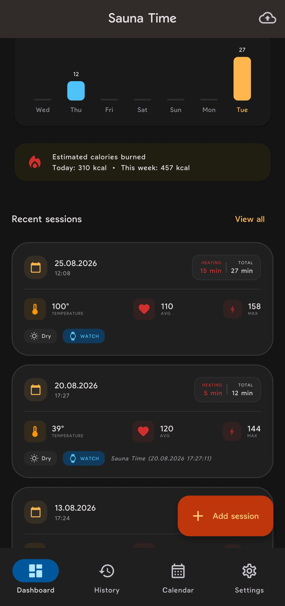
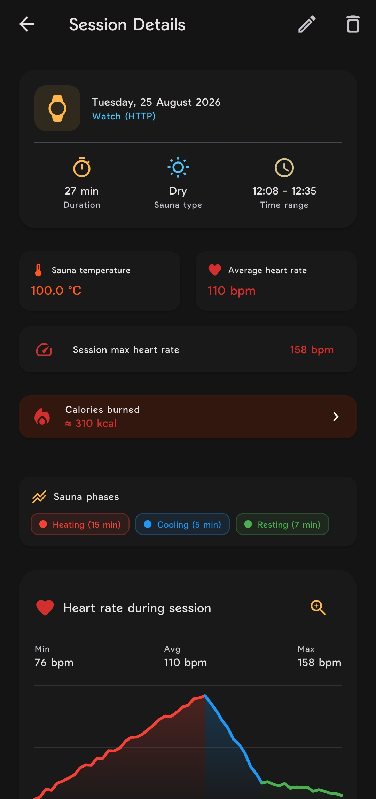
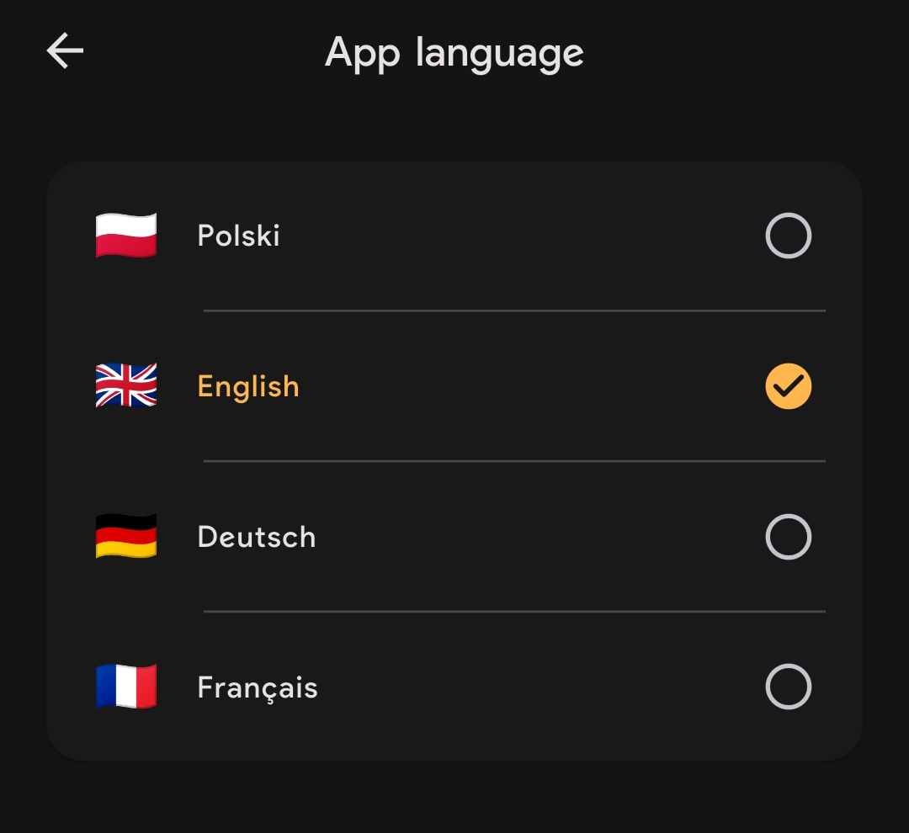

# Sauna Time 🧖‍♂️

Sauna Time is a cross-platform app for tracking sauna sessions on Android and iOS.

You can record sessions manually or receive session data from the Sauna Time app running on Zepp OS / Amazfit watches. The app works offline and keeps your data stored locally on your device.

---

## 📱 Screenshots

  
  
  

---

## ⌚ Smartwatch

Sauna Time can receive data from the **Sauna Time smartwatch app**.

Telemetry synchronization requires smartwatch app version **1.0.14 or newer**.

The watch sends the data over the local network directly to the phone. No cloud service is required.

---

## Features

### Watch data

* Receive telemetry from a Zepp OS / Amazfit watch over the local network.
* Built-in HTTP server for receiving data from the watch.
* Live request log to help with setup and troubleshooting.
* View heart rate and temperature data on charts.
* Zoom and inspect individual points on the charts.
* Separate data for heating, cooling, and resting phases.
* Automatic distinction between skin temperature and sauna temperature.

### Sauna sessions

* Add sessions manually.
* Set session duration, temperature, and heart rate.
* Track multiple phases within a single session.
* View session details and telemetry data.
* Browse your session history.
* Filter sessions by source (manual entry or smartwatch).
* Sort and delete sessions.

### Statistics

* Estimated calories burned using the Keytel formula.
* Different calorie calculation adjustments for dry and steam saunas.
* Weekly summary of session count and total sauna time.
* Calendar view for browsing sessions by date or date range.

### Data and privacy

* Works offline.
* No account or cloud service required.
* All session data is stored locally on the device.
* Export your session history to JSON.
* Import previously exported data with duplicate protection.

### Languages

The app is currently available in:

* English
* Polish
* German
* French

### Appearance

* Light, dark, and system themes.
* Warm colors for heating phases and cool colors for cooling phases.
* Option to display session duration in minutes or exact seconds.

---

## 🛠 Tech Stack

* **Flutter / Dart** – cross-platform application development
* **CustomPainter** – telemetry charts and visualizations
* **Local HTTP server** – communication between the watch and phone
* **Shared Preferences** – local application storage

---

## 📄 Release

This project is currently under active development. Features and the data format may change between releases.

### How to install the application on an Android phone

1. Download the `xxxxx.apk` file directly to your Android phone.
2. Open the downloaded file using a file manager / file browser.
3. Follow the on-screen instructions to install the application.
4. If Android asks for permission to install apps from this source, allow installation from your file manager or browser in the Android settings.
5. Complete the installation and launch the application.

**Alternative:** You can also get the application from an independent app distributor:
[Download the application](https://appdistribution.firebase.dev/i/2aa012622aa52b50?utm_source=chatgpt.com)
